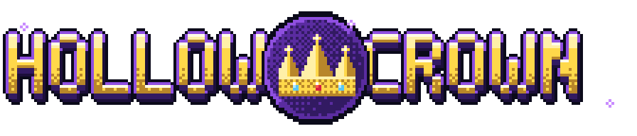
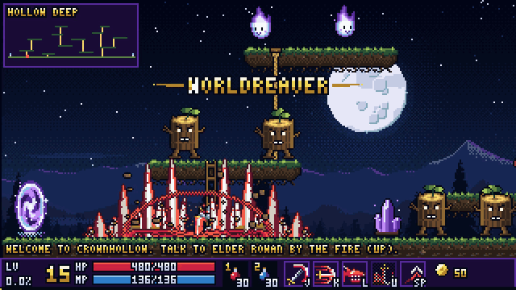
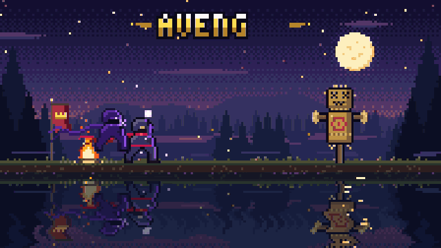
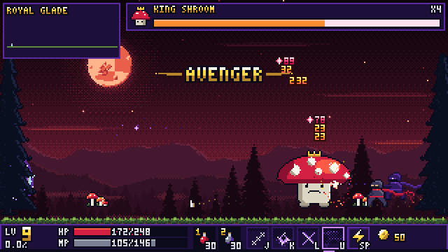
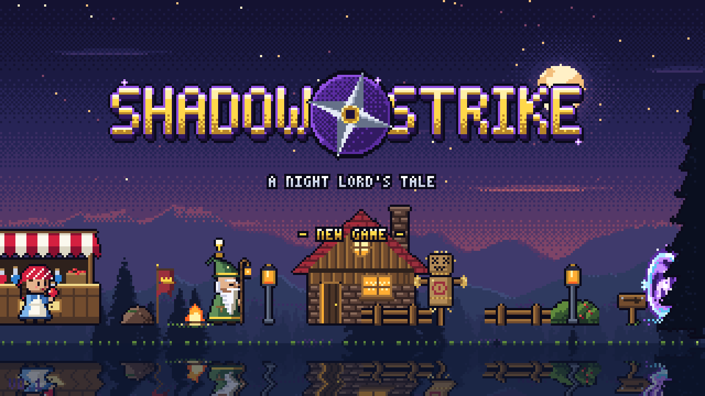
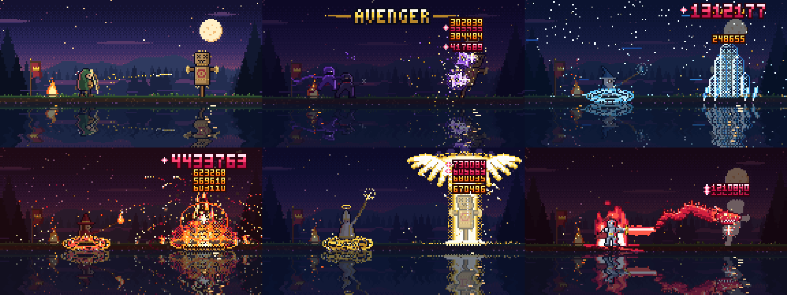
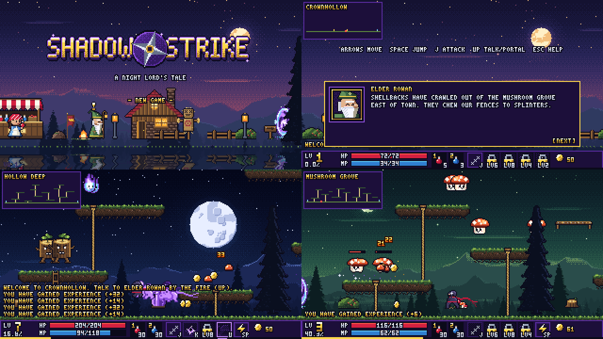
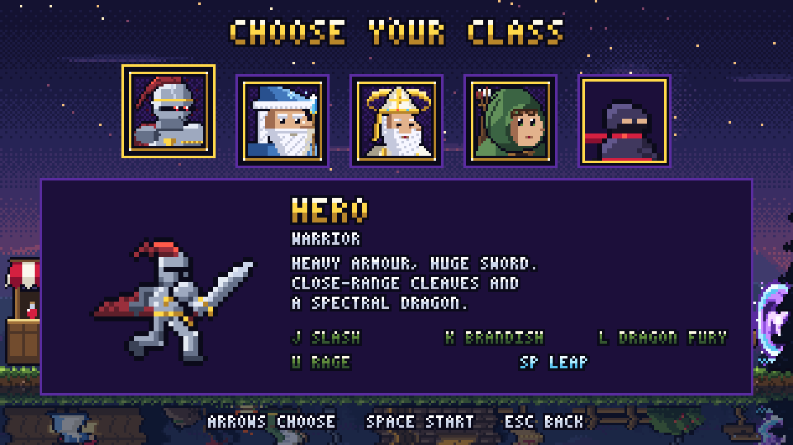
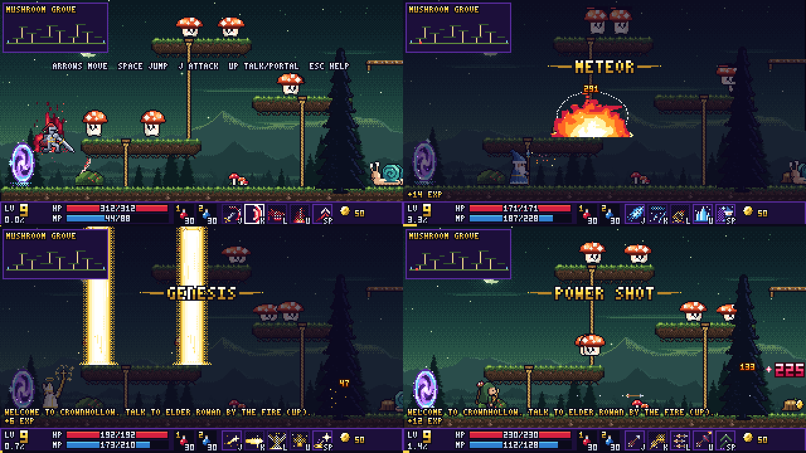
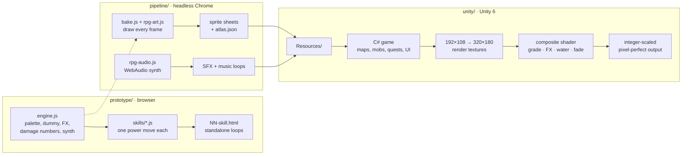

<div align="center">



**A MapleStory-inspired pixel RPG in a Kingdom Two Crowns world, where every sprite, effect, song and sound starts as code.**

[](https://rehan-remade.github.io/shadow-strike/)
[](https://github.com/rehan-remade/shadow-strike/releases/latest)




**[▶ RPG trailer](https://github.com/rehan-remade/shadow-strike/releases/download/v0.1/shadow-strike-rpg-trailer.mp4)** &nbsp;·&nbsp; **[▶ Skill loops video](https://github.com/rehan-remade/shadow-strike/releases/download/v0.1/shadow-strike-skill-loops.mp4)**

</div>

---

## The story

It started as a single prompt: *animate a pixel-art wizard casting a spell, in pure code*. That became a series of
**skill loops**, where each MapleStory-style power move hits a straw training dummy that actually reacts. The loops
were then **baked into sprite sheets and synth audio** and rebuilt in **Unity** as a playable Night Lord. Finally the
project grew into a small **RPG** with towns, quests, monsters, levels and a boss.

| 1 · Code-drawn skill loops | 2 · Playable in Unity | 3 · A MapleStory-style RPG |
|:---:|:---:|:---:|
|  |  |  |
| Canvas 2D + WebAudio, one HTML file per skill | Baked sheets at 1 px per unit, native 192×108 | 320×180, four maps, quests, levels, a boss |

### The skill loops

Six standalone HTML files in [`prototype/`](prototype). Open any of them in a browser. Click for sound, **S** for
slow-mo, **Space** to pause.



| Loop | Class | What happens |
|---|---|---|
| `01-archer` | Archer | A charged power shot knocks a gold coin out of the dummy |
| `05-avenger` | Night Lord | A Shadow Partner clone, grinding giant shurikens, a Triple Throw flurry and an Assassinate X crit |
| `02-blizzard` | Ice mage | An ice-spear storm, then a crystal-cluster freeze that shatters |
| `03-meteor` | Fire mage | A giant molten meteor, a fire dome, and a charred dummy |
| `04-genesis` | Bishop | A pillar of holy light, angel wings and a rhythm of hits |
| `06-dragon` | Warrior | Rage, rush, Brandish crescents, then a spectral dragon bite |

Every loop has hitstop, per-row shear wobble on the dummy, stacked damage numbers, skill callouts and a screen that
darkens while the effects stay bright. All of it is drawn one integer pixel at a time from a fixed palette.

---

## The RPG



**Crownhollow** is a lakeside town under a purple dusk. Talk to **Elder Rowan** by the campfire and follow his quest
chain through the woods to the **King Shroom**.

- **Four maps:** *Crownhollow* (town), *Mushroom Grove* (Lv 1–5), *Hollow Deep* (Lv 5–9) and the *Royal Glade* boss arena.
- **A three-stage boss:** King Shroom telegraphs every stomp and spore with blinking ground markers. At 66% he calls the *Spore Storm* (double stomps, spore rain, capling adds); at 33% he makes his *Final Stand* (red, faster, triple stomps and a three-ring Quake Slam).
- **MapleStory movement:** jump up through platforms, press Down+Jump to drop through, climb ropes and ladders, Flash Jump in mid-air, and press Up at portals.
- **Five classes:** Hero, Arch Mage, Bishop, Bowmaster and Night Lord, each with its own sprite sheet, four skills and a mobility move (see below). Skills unlock as you level and cost MP.
- **Monsters:** Shellbacks, Caplings, Stumpies and Wisps. They patrol and aggro, show HP bars when hit, and drop mesos and items.
- **Progression:** EXP and levels with the golden level-up pillar, HP and MP, red and blue potions, a merchant selling throwing-star upgrades, a four-part quest chain, death with a tombstone and an EXP penalty, and autosave.
- **The UI you remember:** the bottom status bar, the minimap, a compact chat feed that merges and quickly fades pickups ("+42 EXP", "+3 MESOS"), a quest tracker, portrait dialog boxes, the shop window and a layered boss HP bar.

### Classes



Pick a class when you start a new game. Each class ports its prototype skill loop into a full playable kit. Skills don't root you: keep walking and jumping while you cast.

| Class | J | K | L | U | Space ×2 |
|---|---|---|---|---|---|
| **Hero** (warrior) | Slash | Rush (charge that carries monsters) | Dragon Fury | Worldreaver (ground slam, erupting fissures) | Leap |
| **Arch Mage** (magician) | Ice Bolt | Blizzard | Meteor | Ice Strike | Teleport (aim with the arrows) |
| **Bishop** (priest) | Holy Arrow | Angel Ray (an angel pours a holy beam) | Genesis | Heal | Teleport (aim with the arrows) |
| **Bowmaster** (archer) | Arrow | Power Shot | Hurricane | Arrow Bomb | Double Jump |
| **Night Lord** (thief) | Triple Throw | Avenger | Assassinate | Shadow Partner | Flash Jump |



### Controls

| Key | Action |
|---|---|
| **← →** | Move |
| **Space** | Jump · press again in the air for your class's mobility skill |
| **↓ + Space** | Drop through a platform |
| **↑** | Climb, talk to an NPC, enter a portal |
| **J · K · L · U** | Basic attack and the three class skills (see the table above) |
| **1 · 2** | Red / blue potion |
| **Esc** | Help and pause (**Q** saves and quits to the title) |
| type **MAPLE** | Cheat: jump to level 30 with every skill unlocked |

---

## How it works



- **No hand-drawn assets.** Characters are string-map sprites with procedural arms, weapons and scarves. Monsters and props are drawn into index grids and auto-outlined. Skies, mountains and forests come from dithered gradients and seeded noise. Music comes from a tiny sequencer in `OfflineAudioContext`.
- **The prototype is the source of truth.** The bake step runs the prototype's own drawing code in headless Chrome over the DevTools protocol and captures each frame. The Unity game and the canvas loops therefore share exactly the same art.
- **Pixel-perfect Unity.** One pixel equals one world unit, and point filtering is on. Every position is snapped to integers. The game renders into a native-resolution render texture, then a world layer and an FX layer pass through a small composite shader: a colour grade for the boss entrance, FX kept bright on top, a rippled water reflection, flashes and fades. The result is upscaled by a whole number.
- **The game is deterministic.** A fixed 60 Hz tick, seeded randomness and scripted input mean the Unity build can record its own trailer frame by frame: `-autoplay -capture <dir>`.

### Repository layout

```
prototype/   canvas engine, skill loops (src/), standalone HTML loops, video renderer
pipeline/    sprite + audio bakers (bake.js, rpg-art.js, rpg-class-*.js, rpg-audio.js), asset contracts, audio mixer
unity/       Unity 6 project - Assets/Scripts (game), Assets/Editor (headless setup/build), Assets/Resources (baked art + audio)
media/       README images
```

---

## Build from source

**Requirements:** Node 22+, `chrome-headless-shell` (`npx @puppeteer/browsers install chrome-headless-shell`),
ffmpeg, and Unity **6000.4.1f1** with Windows or WebGL build support.

```bash
# rebuild the standalone skill loops, then render a back-to-back skills video
cd prototype
node build.mjs
node render-video.mjs skills.mp4 05-avenger.html 02-blizzard.html 03-meteor.html 04-genesis.html 06-dragon.html
cd ..

# re-bake all game art + audio into the Unity project
node pipeline/bake-run.mjs
```

Open `unity/` in Unity 6, or build headless:

```bash
Unity -batchmode -quit -projectPath unity -executeMethod Setup.BuildWin   # or Setup.BuildWeb
```

Useful player flags: `-autoplay` (grind bot), `-map grove -level 5 -class archmage` (jump straight in), `-classselect`, `-capture <dir> -frames N` (deterministic frame dump).

---

## Credits

Designed and built with **[Claude Code](https://claude.com/claude-code)**. The skill loops, pixel art, synth music,
bake pipeline and Unity game were all generated as code in conversation, with parallel agents drawing the art and
composing the soundtrack.

Inspired by the Opus 5.5 pixel-wizard demo by [@majidmanzarpour](https://x.com/majidmanzarpour), and by *MapleStory*
and *Kingdom Two Crowns*.

> **A fan project.** Shadow Strike is not affiliated with or endorsed by Nexon (MapleStory) or Raw Fury (Kingdom Two
> Crowns). Skill names are an affectionate homage. All art and audio in this repository are original and generated by
> code.

Code is released under the [MIT License](LICENSE).
